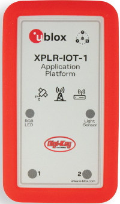
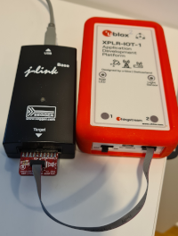
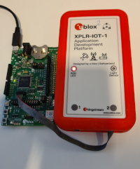

# WORK In PROGRESS
# NOT COMPLETE YET

# Learning by examples

This repo is intended to be a starting point on how to use the Ublox open source library [ubxlib](https://github.com/u-blox/ubxlib). The intended target system here is the [XPLR-IOT-1](https://www.u-blox.com/en/product/XPLR-IOT-1) device but most of the examples are also applicable to
any Ublox module or EVK supported by ubxlib.

The main focus here is to make everything as uncomplicated as possible. The host mcu in a XPLR-IOT-1 device is the Nordic nRF5340. Unless you are familiar with the nRFConnect SDK and the Zephyr RTOs the learning curve for mastering the development environment for this chip is quite steep. This repo tries to raise the abstraction layer and let you focus on the actual programming using ubxlib.

The interface to building, running and debug software for ubxlib can be either the command line or [Microsoft Visual Studio Code](https://code.visualstudio.com/).

Both Windows (Windows 10 tested) and Debian Linux (Ubuntu 20.04 tested) are supported.

There are two ways of using this repository based on what you have installed on your PC.

If you already have the Nordic nRFConnect SDK installed and know how to use it, you can just clone this repository and go on from there directly.

    git clone --recursive https://github.com/plerup/xplriot1_examples.git

On the other hand if this is your first encounter with the Nordic nrf53 chipset a complete installation script which includes everything needed for development is provided. In this case [goto this page](install/README.md) for more information about the installation process.

# Requirements

To use this repo you need at least a XPLR-IOT-1 device. Please note though that this device doesn't contain any debug chip so in order to be able to do debugging you need to have some kind of debugger/programmer device. This can be a JLink debugger, a Ublox EVK or a Nordic Development board. You also need a 10 pin programmer cable to connect the XPLR-IOT-1 and the programmer. Examples shown below:

However it is still possible to build and flash the examples into a XPLR-IOT-1 without a programmer. This is then made through a usb cable connected to the unit. No debugging is however possible in this case.

Please note that the usb cable should also be inserted if you want to see printouts from the example programs.

# A first step

Begin by starting a command window. Then change working directory to where the repository was cloned. If you have used the installation script this will be in a directory underneath your home directory named xplriot1\xplriot1_examples.

The issue the following command:

Windows:

    do vscode

Linux:

    ./do vscode

This will execute a complete build of the simple blink example and then start Visual Studio Code.

Once Visual Studio Code has started you will find the main.c source code in a window.

From within Visual Studio Code you can the build, rebuild, flash and run the examples. This is done via selecting the menus Terminal -> Run Build Task or by pressing the shortcut ctrl-shift-b. Choose "Build and run example" to flash and start the blink example and the red led of your XPLR-IOT-1 should start blinking.

You can then select another ot the examples by clicking on the "blink" text in the lower right corner of the Visual Studio Code window and then select one of the examples in the selection list. This can also be done via ctrl-shift-p and then enter "C/C++: Select a configuration". Once selected chose "Build and run example" again.

If you have a debug unit you can then also select the debug icon on the let side, the select the green arrow and a debugging session will start. The program will stop at the first line in the program. Experiment wit the different debug functions in Visual Studio Code such as steping, check variables etc.

You can the start modifying the examples to you liking or add your own, more about that further down.

# Next steps

# Advanced usage
